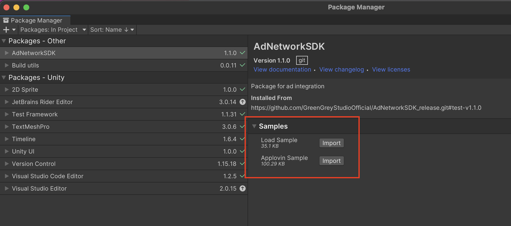
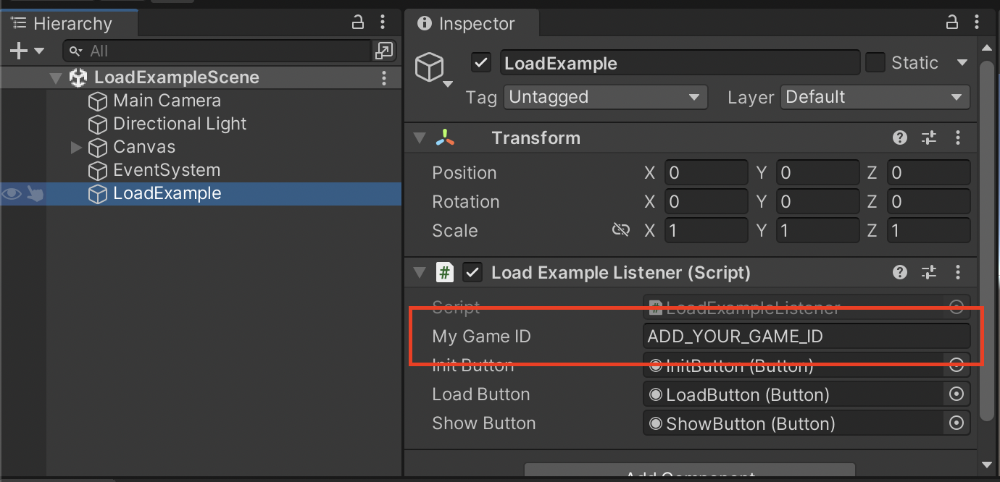

## Интеграция в проект
Библиотека распространяется как пакет для Package Manager.

Текущая версия: v1.1.0

## 0. Что понадобится для интеграции?

GAME_ID - идентификатор приложения в системе показа рекламы

Его Вы можете получить у Александра Бобкова

Ссылка на проект в git [https://github.com/GreenGreyStudioOfficial/AdNetworkSDK_release](https://github.com/GreenGreyStudioOfficial/AdNetworkSDK_release)

## 1. Добавление в проект

1.1 В панели Package Manager выберите Add package from git URL

 

1.2 В открывшемся окне введите ссылку

[https://github.com/GreenGreyStudioOfficial/AdNetworkSDK_release.git#v1.1.0](https://github.com/GreenGreyStudioOfficial/AdNetworkSDK_release.git#v1.1.0)

1.3 Для загрузки примера использования нужно в панели Package Manager выбрать AdNetworkSDK, в правой части развернуть список примеров и нажать кнопку “Import”

После этого рядом с успешно импортированными примерами появится галочка, а сами файлы примеров окажутся в структуре проекта

 | 
-|-

1.4 Для запуска примера необходимо прописать полученный идентификатор GAME_ID в соответствующем поле редактора:

---

[<< назад](manual.md) [далее >>](main-principles.md)